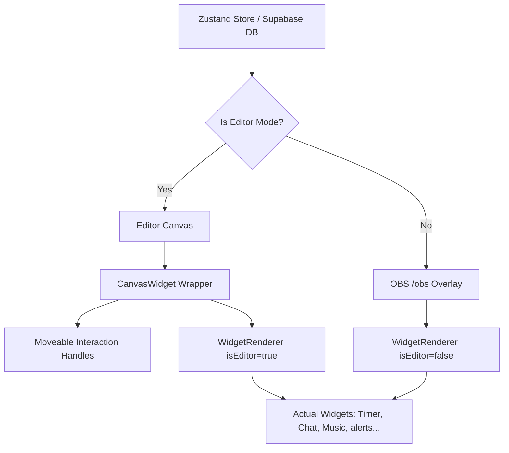

# Canvas Render Audit – VibeOverlay Studio

This document audits the rendering architecture of VibeOverlay Studio 2.0. It explains the unification of the Editor Canvas, Preview Window, and OBS Overlay under a single component pipeline, and reviews how positioning overrides and styling constraints are resolved.

---

## 1. Unified Render Pipeline

Previously, the Editor Canvas rendered simple icons or static mocks (`⏱`, `💬`, `🎵`) as placeholders, while the OBS Overlay executed full widget scripts. This caused massive visual drift between what a user configured on screen and what appeared in OBS.

The rendering pipeline has been unified using a shared component:



By directing both editor and production streams through `WidgetRenderer.tsx`, streamers get a true **What-You-See-Is-What-You-Get (WYSIWYG)** editing experience.

---

## 2. Positioning & CSS Normalization

The shared use of `WidgetRenderer.tsx` introduces a positioning challenge:
* **In Live / OBS mode**: `WidgetRenderer` positions itself using absolute pixel offsets from the `containerStyle` object (`left: widget.x`, `top: widget.y`, etc.).
* **In Editor mode**: The outer wrapper component `.canvas-widget` is controlled and placed by `Moveable`. If `WidgetRenderer` also applied its absolute positions, the element would double-offset (`2x` translate).

### The Normalization Override
To solve this, a CSS override is added to `src/index.css` that disables the inner positioning of `WidgetRenderer` when nested inside a `.canvas-widget` editor box:

```css
/* ── Normalize WidgetRenderer when nested inside Editor Canvas ── */
.canvas-widget > div[id^="w-"] {
  left: 0 !important;
  top: 0 !important;
  width: 100% !important;
  height: 100% !important;
  position: relative !important;
  transform: none !important;
}
```

* **Why it works**: By marking these styles as `!important`, we reset the inner container to fill the parent wrapper $100\%$, resetting its `left`, `top`, and `transform` values. The outer `.canvas-widget` wrapper remains the sole source of truth for positioning, rotation, and scale during Moveable interactions.
* **Compatibility**: In the live OBS route, the parent wrapper is absent, and `WidgetRenderer`'s absolute styling remains active, positioning elements exactly as saved.

---

## 3. Typography and Scaling Audit

### Viewport Units (`vw`) vs. Pixel Units (`px`)
* **The Bug**: Early versions styled font sizes using viewport width units (`vw`) to make them responsive. However, in the editor panel, changing the sidebar layout width or resizing the canvas viewport modified the active layout context, triggering text size jittering and visual distortion.
* **The Solution**: All typography is normalized to explicit pixel values (`px`) in style configurations. Font sizes are set relative to the element's design bounds.
* **OBS Scaling**: When the live OBS layout is scaled using transform matrices to fit the browser viewport, the pixel-defined text scales proportionally without layout shifting.
* **Google Fonts Support**: To prevent missing fonts, the theme profile stylesheet import dynamically loads the requested font families directly from Google Fonts at runtime.
