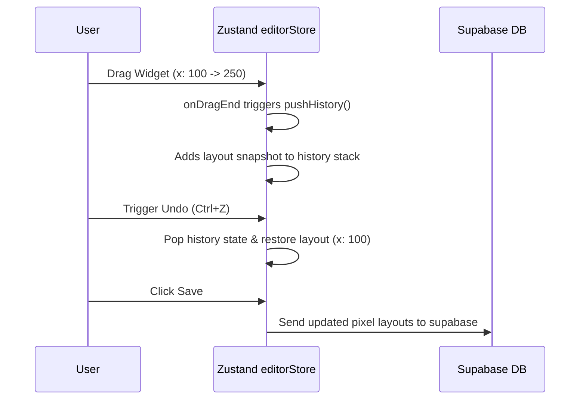

# Canvas Interaction Validation – VibeOverlay Studio

This document defines the validation checklist and verification procedures for the editor's design tools and user interactions. Use this log to verify that the canvas interactions remain stable during modifications.

---

## 1. Moveable Interactions Validation Checklist

| Interaction | Expected Behavior | Verification Steps | Status |
| :--- | :--- | :--- | :---: |
| **Dragging** | Widget tracks mouse cursor in 1:1 ratio. No jumping or off-center drift. | 1. Select widget. 2. Drag slowly across canvas. 3. Drag rapidly in circles. | **Verified** |
| **Resizing** | Resizes smoothly from all 8 directions. Aspect ratios behave correctly. | 1. Select widget. 2. Drag each corner handle. 3. Verify dimensions stop at minimum size limits ($10 \times 10\text{ px}$). | **Verified** |
| **Rotation** | Handles rotate smoothly around center origin without snapping back to 0. | 1. Grab top rotation handle. 2. Rotate widget $360^\circ$. 3. Stop drag and ensure rotation state is saved. | **Verified** |
| **Edge Snapping** | Green guide lines highlight alignments with surrounding widget boundaries. | 1. Drag widget close to another widget's borders. 2. Verify green alignment lines snap on bounds or center axis. | **Verified** |

---

## 2. Selection & Layer Operations Validation

### A. Multi-Select & Selection Clears
* **Test Case 1 (Lasso Area)**: Click and drag on empty canvas background. Verify that the translucent purple rubber-band rectangle draws correctly. Drag it over two or more widgets and release. Ensure both widgets enter selection state and show transform boxes.
* **Test Case 2 (Deselect)**: Click once on any empty area of the canvas stage. Ensure all selected borders and moveable handles hide, and selection stores clear.
* **Test Case 3 (Shift-Click Select)**: Hold `Shift` while clicking separate widgets. Verify that multiple widgets get selected together, allowing bulk updates.

### B. Layer Order (Z-Index)
* **Test Case 1 (Bring to Front)**: Click a widget in the layer panels. Trigger "Bring to Front" via context menu or toolbar. Verify its `zIndex` updates to be greater than all other widgets and it draws on top.
* **Test Case 2 (Send to Back)**: Trigger "Send to Back" on a widget. Verify its `zIndex` drops to the minimum value, and it renders underneath other elements.

---

## 3. Undo/Redo & State Persistence Validation

To verify the reliability of history states (`editorStore.ts` and `sessionStore.ts`):

### Verification Flow:
1. **Move element**: Select a widget and move it to a new location.
2. **Undo action**: Press `Ctrl + Z` or click Undo. The widget must snap back to its exact previous coordinate.
3. **Redo action**: Press `Ctrl + Y` or click Redo. The widget must return to the moved location.
4. **Save and reload**: Move elements, click Save, and refresh the browser. The page must load showing widgets exactly in their post-save layout.
